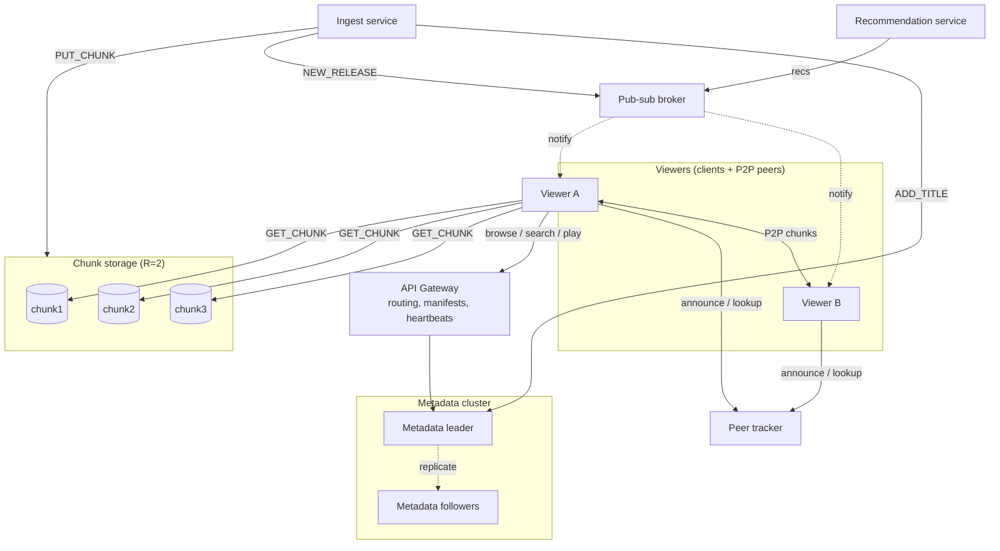

# StreamSim: A Distributed Video-Streaming System
### Phase 1: Architecture & System Model

## 1. Purpose

StreamSim is a Netflix-like video-streaming simulation. Viewers browse and search a catalog, then stream a title. Videos are split into chunks, and those chunks are replicated across storage nodes and also shared between viewers (P2P). Metadata lives in its own replicated service coordinated by an elected leader, and a publish-subscribe broker notifies viewers about new releases and recommendations. The goal is to keep media **available, fast to deliver, and consistent** while nodes, peers, and links fail.

## 2. Main Services / Components

| Component | Responsibility | Phase 1 status |
|---|---|---|
| **Viewer client** | Browse, search, play; fetches chunks and verifies SHA-256 hashes; later also acts as a P2P peer |  `client.py` |
| **API gateway** | Single entry point for clients; routes requests to services; builds playback manifests ordered by node health (heartbeats) |  `gateway.py` |
| **Metadata (catalog) service** | Titles, genres, search, chunk manifests (which chunk lives on which node) |  `metadata.py` (single instance) |
| **Chunk storage nodes** | Store and serve video chunks from local disk |  `chunk_node.py` ×3 |
| **Ingest service** | Splits uploaded videos into chunks, replicates them, registers the title |  `ingest.py` |
| **Pub-sub broker** | Topics like `new-releases` and `recs.<user>`; ingest and recommendation services publish, clients subscribe | Planned |
| **Recommendation service** | Publishes personalized suggestions from viewing history | Planned |
| **Peer tracker** | Tracks which peers hold which chunks so clients can fetch from peers | Planned |
| **Coordination** | Leader election (Bully algorithm) among metadata replicas; the leader serializes all metadata writes | Planned |

Communication uses **TCP sockets** with newline-delimited JSON messages (`type`, `req_id`, `sender`, `payload`).

## 3. Clients, Servers, Peers, Shared Resources

- **Clients:** viewer apps. The gateway is also a client of the metadata service, and the ingest service is a client of the storage nodes and metadata service.
- **Servers:** the gateway, metadata replicas, chunk storage nodes, pub-sub broker, and peer tracker.
- **Peers:**
  - *Viewer peers:* viewers who already hold chunks upload them to other viewers (P2P distribution).
  - *Storage peers:* chunk nodes have identical roles and hold replicas of each other's data.
  - *Metadata replicas:* peers that elect one leader among themselves.
- **Shared resources:**
  - Video chunks, shared by all viewers and replicated across nodes and peers.
  - The metadata catalog, shared by every service. Writes are coordinated through the leader.
  - Storage capacity and upload bandwidth, including bandwidth contributed by peers.
  - Pub-sub topics.

## 4. System Model

### 4.1 Organization: *Hybrid*
- **Centralized:** the API gateway is the entry point, and the metadata leader is the single writer for catalog updates.
- **Distributed:** chunk storage is spread across replicated nodes, and metadata is replicated across nodes.
- **Decentralized:** P2P chunk sharing between viewers.

This mix keeps control-plane logic simple, while the data plane (the actual video bytes) scales out.

### 4.2 Timing: *Semi-synchronous (partially synchronous)*
- There is no global clock, and process speeds and message delays are unbounded in theory.
- In practice we assume delays are **usually** bounded:
  - Requests time out after 2 s and are treated as lost.
  - The gateway sends heartbeats every 3 s and **suspects** a node that doesn't answer within 1 s.
- The failure detector is **unreliable**: a slow node can be falsely suspected. The system recovers when that node responds again.
- Leader election (later phase) relies on the same timeout assumptions.

### 4.3 Node-failure assumptions: *Crash-recovery, non-Byzantine servers*
- Servers fail by **crashing**. They may restart and recover state from disk (chunks on disk, `catalog.json`).
- At most **1 of 3** chunk nodes fails at once, so with replication factor 2 every chunk keeps at least one live copy.
- The metadata service tolerates the leader crashing: a new leader is elected (later phase).
- **Peers are unreliable and untrusted.** They can leave at any time (churn) or send bad data. Every chunk is checked against the SHA-256 hash in the manifest, and bad chunks are rejected and re-fetched from another source.
- The gateway is assumed not to fail in Phase 1; it could later be replicated behind a load balancer.

### 4.4 Link-failure assumptions: *Fair-loss links over TCP*
- TCP delivers messages uncorrupted, in order, and without duplicates within a connection.
- Messages **can be lost or delayed**, and connections can drop. Timeouts detect this, and clients retry against another replica.
- Links between the viewer and a peer are the least reliable (home networks), so a peer is always an *optional* source and a server replica is the fallback.
- **Network partitions inside the server cluster are out of scope for Phase 1.** A partitioned node is indistinguishable from a crashed node. Handling split-brain during leader election is a later-phase concern.

### 4.5 Storage assumptions
- Each chunk node has **its own local disk**, with no shared storage. Chunks are fsync'd before being acknowledged.
- Chunks are **immutable** once written, so replicas never conflict. Integrity is checked with SHA-256.
- Metadata is persisted with atomic file writes. Once replicated (later phase), writes go through the leader so replicas stay consistent.
- Peers cache chunks in **volatile, bounded** storage; that cache can disappear at any time.
- Disk corruption and permanent node loss beyond one node are out of scope.

## 5. Architecture Diagram

The diagram includes both the current Phase 1 implementation and components planned for later phases.

## 6. Scalability, Dependability, Resource Sharing

### Scalability
- **Separate control and data planes:** small metadata requests go through the gateway, while large chunk transfers go **directly** from storage nodes (or peers) to the client. Video bytes never bottleneck the gateway.
- **Horizontal storage:** add chunk nodes to add capacity, since placement is computed per chunk.
- **Read scaling:** metadata followers can serve browse and search reads, while only writes go to the leader.
- **P2P offloading:** popular titles get *more* sources as more people watch them, so load spreads naturally.
- **Pub-sub decoupling:** publishers don't need to know how many viewers exist.
- **Concurrency:** every service uses a threaded socket server.

### Dependability
- **Replication:** every chunk is stored on 2 nodes (`REPLICATION_FACTOR`).
- **Failover:** if a chunk source fails, the client tries the next one. The skeleton demonstrates this with `--fail chunk2`: all titles still play.
- **Failure detection:** gateway heartbeats move suspected-down nodes to the end of each manifest's source list.
- **Integrity:** SHA-256 checks protect against corrupted or malicious chunks, which is essential once peers serve data.
- **Durability:** chunks are fsync'd, and the catalog uses atomic writes; both survive restarts.
- **Coordination (later phase):** leader election keeps catalog writes available after the leader crashes.
- **Observability:** every socket message is logged with a request ID that follows the request across services.

### Resource Sharing
- Many viewers share one catalog and one pool of stored chunks through a location-transparent API; they never need to know where data lives.
- Viewers share their own upload bandwidth and cached chunks with each other (P2P).
- Access to the shared catalog is coordinated (a lock now; a single leader later) so concurrent updates stay consistent.
- Pub-sub topics are shared channels that many subscribers read from.

## 7. Phase 1 Implementation Skeleton

| Requirement | Where it's met |
|---|---|
| ≥3 communicating processes | client, gateway, metadata, chunk1–3, ingest (7 processes) |
| Simple client request | `BROWSE`, `SEARCH`, `PLAY` over TCP sockets |
| Simple server response | JSON `{status, data}` responses |
| Message logging | Every SEND/RECV/FAIL goes to stdout and `logs/<process>.log` |

### Playback flow
1. The client sends `PLAY v001` to the gateway.
2. The gateway sends `GET_MANIFEST` to the metadata service.
3. The gateway orders each chunk's sources so live nodes come first, then returns the manifest.
4. The client sends `GET_CHUNK` directly to storage nodes, verifies each hash, and fails over when a source doesn't respond.

### Roadmap to full requirements
| Requirement | Planned approach |
|---|---|
| Pub-sub notifications | Broker process with SUBSCRIBE/PUBLISH over persistent sockets; ingest publishes `NEW_RELEASE` |
| P2P | Tracker process; clients announce held chunks and serve `GET_CHUNK` from a local cache |
| Leader election | Bully algorithm across 3 metadata replicas; the leader accepts `ADD_TITLE` and replicates to followers |
| Fault tolerance | Re-replication when a chunk node stays down; client-side retry and backoff |
